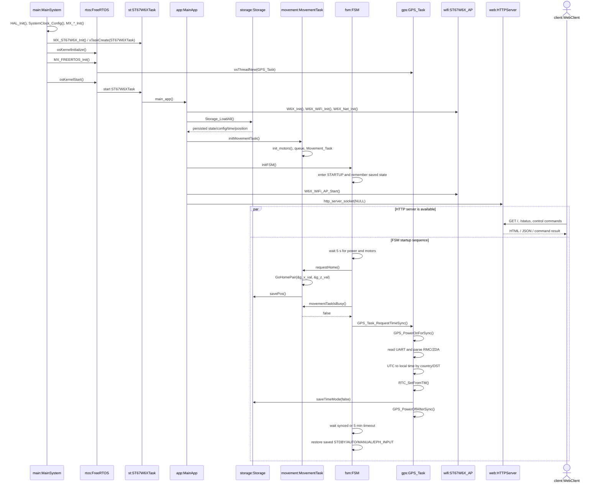

# Diagrama de secuencia de inicio - BoUML

Este documento describe la secuencia real de arranque del proyecto STM32 WiFi Window Control para recrearla en BoUML.

## Lifelines recomendadas

| Lifeline BoUML | Elemento del proyecto | Rol |
| --- | --- | --- |
| `main:MainSystem` | `main.c` | Inicializa HAL, reloj, perifericos, FreeRTOS y ST67W6X. |
| `rtos:FreeRTOS` | `app_freertos.c` | Crea `defaultTask` y `GPS_Task`, y arranca el scheduler. |
| `st:ST67W6XTask` | `app_st67w6x.c` | Tarea de ST que ejecuta `main_app()`. |
| `app:MainApp` | `main_app.c` | Inicializa WiFi, red, aplicacion solar, AP y servidor HTTP. |
| `storage:Storage` | `storage.c` | Recupera estado, posicion, pais, hora y configuracion persistente. |
| `movement:MovementTask` | `movement_task.cpp` | Inicializa motores y ejecuta movimientos/homing en cola. |
| `fsm:FSM` | `state_machine.c` | Gestiona `STARTUP`, homing inicial, sync GPS y modo final. |
| `gps:GPS_Task` | `gps.cpp` | Activa el switch GPS, lee NMEA y sincroniza RTC. |
| `wifi:ST67W6X_AP` | `main_app.c` / ST middleware | Levanta el Soft-AP y la pila de red. |
| `web:HTTPServer` | `httpserver.c` | Atiende peticiones web. |
| `client:WebClient` | navegador del usuario | Se conecta al AP y usa la interfaz web. |

## Mensajes principales para dibujar

1. `main:MainSystem -> main:MainSystem : HAL_Init(), SystemClock_Config(), MX_*_Init()`
2. `main:MainSystem -> st:ST67W6XTask : MX_ST67W6X_Init() / xTaskCreate()`
3. `main:MainSystem -> rtos:FreeRTOS : osKernelInitialize()`
4. `main:MainSystem -> rtos:FreeRTOS : MX_FREERTOS_Init()`
5. `rtos:FreeRTOS -> gps:GPS_Task : osThreadNew(GPS_Task)`
6. `main:MainSystem -> rtos:FreeRTOS : osKernelStart()`
7. `rtos:FreeRTOS -> st:ST67W6XTask : start task`
8. `st:ST67W6XTask -> app:MainApp : main_app()`
9. `app:MainApp -> wifi:ST67W6X_AP : W6X_Init(), W6X_WiFi_Init(), W6X_Net_Init()`
10. `app:MainApp -> storage:Storage : Storage_LoadAll()`
11. `app:MainApp -> movement:MovementTask : initMovementTask()`
12. `movement:MovementTask -> movement:MovementTask : init_motors(), xQueueCreate(), xTaskCreate()`
13. `app:MainApp -> fsm:FSM : initFSM()`
14. `fsm:FSM -> fsm:FSM : thisSt = STARTUP; startupReturnState = saved state`
15. `app:MainApp -> wifi:ST67W6X_AP : W6X_WiFi_AP_Start()`
16. `app:MainApp -> web:HTTPServer : http_server_socket(NULL)`
17. `client:WebClient -> web:HTTPServer : GET / or API request`
18. `web:HTTPServer -> client:WebClient : HTML/status/control response`

## Startup interno de la FSM

1. `fsm:FSM -> fsm:FSM : wait 5 s power/motor settle`
2. `fsm:FSM -> movement:MovementTask : requestHome()`
3. `movement:MovementTask -> movement:MovementTask : GoHomePair(&g_x_val, &g_z_val)`
4. `movement:MovementTask -> storage:Storage : savePos()`
5. `fsm:FSM -> movement:MovementTask : movementTaskIsBusy()`
6. `movement:MovementTask --> fsm:FSM : false`
7. `fsm:FSM -> gps:GPS_Task : GPS_Task_RequestTimeSync()`
8. `gps:GPS_Task -> gps:GPS_Task : GPS_PowerOnForSync()`
9. `gps:GPS_Task -> gps:GPS_Task : parse RMC/ZDA, convert UTC to local time`
10. `gps:GPS_Task -> gps:GPS_Task : RTC_SetFromTM()`
11. `gps:GPS_Task -> storage:Storage : saveTimeMode(false)`
12. `gps:GPS_Task -> gps:GPS_Task : GPS_PowerOffAfterSync()`
13. `fsm:FSM -> fsm:FSM : wait GPS synced or 5 min timeout`
14. `fsm:FSM -> fsm:FSM : fsmFinishStartup(); restore saved STDBY/AUTO/MANUAL/EPH_INPUT`

## Diagrama Mermaid de referencia

## Notas para defenderlo

- El servidor HTTP no espera a que termine el homing ni la sincronizacion GPS; ambas cosas quedan delegadas a tareas FreeRTOS.
- `STARTUP` es un estado transitorio de RAM: no se persiste en flash.
- El homing inicial se lanza despues de 5 s para dar tiempo a que la alimentacion y los motores esten estables.
- La sincronizacion GPS no bloquea `main_app()`: la FSM solo levanta una peticion y `GPS_Task` la atiende cuando recibe una trama NMEA valida.
- Al terminar el arranque, la FSM vuelve al modo guardado en flash.

## Archivos que justifican el diagrama

- `Core/Src/main.c`: inicializacion HAL, perifericos, kernel y scheduler.
- `ST67W6X/App/app_st67w6x.c`: crea `ST67W6XTask` y llama a `main_app()`.
- `Appli/App/main_app.c`: inicializa ST67W6X, llama a `SolarApp_Start()`, levanta AP y servidor HTTP.
- `Core/Src/solar_app.c`: carga persistencia, movimiento y FSM.
- `Core/Src/state_machine.c`: estado `STARTUP`, homing inicial, sync GPS y retorno al modo guardado.
- `Core/Src/movement_task.cpp`: cola de movimiento, `CMD_HOME`, `GoHomePair()` y guardado de posicion.
- `Core/Src/gps.cpp`: switch GPS, parseo NMEA, conversion UTC-local, escritura RTC y apagado GPS.
- `Core/Src/storage.c`: carga/guardado de estado, posicion y modo de hora.
