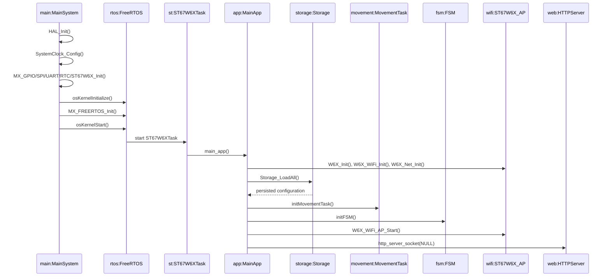

# Diagrama de secuencia de inicio simple - BoUML

Este es el diagrama macro de arranque para presentacion. No entra en el detalle interno de `STARTUP`, homing ni sincronizacion GPS; eso queda para un diagrama posterior centrado en la FSM.

## Lifelines recomendadas

| Lifeline BoUML | Elemento del proyecto | Rol |
| --- | --- | --- |
| `main:MainSystem` | `main.c` | Inicializacion base del microcontrolador. |
| `rtos:FreeRTOS` | `app_freertos.c` | Inicializacion del kernel y tareas base. |
| `st:ST67W6XTask` | `app_st67w6x.c` | Tarea principal del middleware WiFi ST67W6X. |
| `app:MainApp` | `main_app.c` | Arranque de WiFi, red, aplicacion solar y servidor. |
| `storage:Storage` | `storage.c` | Carga de configuracion persistente. |
| `movement:MovementTask` | `movement_task.cpp` | Preparacion de cola/tarea de movimiento. |
| `fsm:FSM` | `state_machine.c` | Inicializacion de la maquina de estados. |
| `wifi:ST67W6X_AP` | ST67W6X middleware | Arranque del punto de acceso WiFi. |
| `web:HTTPServer` | `httpserver.c` | Servidor HTTP de la interfaz web. |

## Mensajes principales

1. `main:MainSystem -> main:MainSystem : HAL_Init()`
2. `main:MainSystem -> main:MainSystem : SystemClock_Config()`
3. `main:MainSystem -> main:MainSystem : MX_GPIO/SPI/UART/RTC/ST67W6X_Init()`
4. `main:MainSystem -> rtos:FreeRTOS : osKernelInitialize()`
5. `main:MainSystem -> rtos:FreeRTOS : MX_FREERTOS_Init()`
6. `main:MainSystem -> rtos:FreeRTOS : osKernelStart()`
7. `rtos:FreeRTOS -> st:ST67W6XTask : start ST67W6XTask`
8. `st:ST67W6XTask -> app:MainApp : main_app()`
9. `app:MainApp -> wifi:ST67W6X_AP : W6X_Init(), W6X_WiFi_Init(), W6X_Net_Init()`
10. `app:MainApp -> storage:Storage : Storage_LoadAll()`
11. `app:MainApp -> movement:MovementTask : initMovementTask()`
12. `app:MainApp -> fsm:FSM : initFSM()`
13. `app:MainApp -> wifi:ST67W6X_AP : W6X_WiFi_AP_Start()`
14. `app:MainApp -> web:HTTPServer : http_server_socket(NULL)`

## Nota para BoUML

Para que se lea bien en una diapositiva, configura el diagrama con una fuente aproximadamente tres veces mayor que la fuente por defecto. Si tu BoUML esta en 10-12 pt, usa 30-36 pt para nombres de objetos y mensajes.

## Diagrama Mermaid de referencia

## Archivos que justifican el diagrama

- `Core/Src/main.c`
- `Core/Src/app_freertos.c`
- `ST67W6X/App/app_st67w6x.c`
- `Appli/App/main_app.c`
- `Core/Src/solar_app.c`
- `Core/Src/storage.c`
- `Core/Src/movement_task.cpp`
- `Core/Src/state_machine.c`
